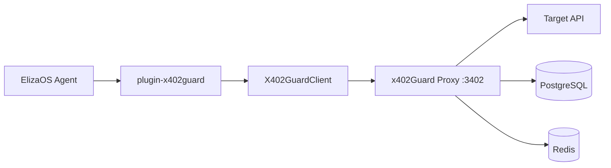

# @elizaos/plugin-x402guard

x402Guard guardrail proxy integration plugin for [ElizaOS](https://elizaos.ai) agents.

This plugin enables ElizaOS agents to make **guarded DeFi payments** through the x402Guard proxy. All payments pass through configurable guardrail rules (spend limits, contract whitelists, leverage caps) before being forwarded to target APIs.

## Overview

**x402Guard** is a non-custodial guardrail proxy for autonomous AI agents making on-chain payments. It verifies EIP-3009 `TransferWithAuthorization` signatures and enforces configurable spending limits, contract whitelists, and other guardrails -- without ever holding agent funds.

This plugin wraps the x402Guard proxy as an **ElizaOS Action** and **Provider**, allowing any ElizaOS agent to:

- Make guarded x402 payments (EVM and Solana)
- Check proxy health status in agent context
- Handle guardrail violations with structured error details

## Architecture



**Flow:**
1. ElizaOS agent receives a payment request
2. Plugin's `GUARDED_PAYMENT` action extracts payment parameters
3. `X402GuardClient` sends the request to the x402Guard proxy
4. Proxy validates guardrail rules (spend limits, whitelists, etc.)
5. If rules pass, proxy forwards the payment to the target API
6. If rules fail, a `GuardrailViolationError` is returned with details

## Prerequisites

- **Node.js** 22+ (LTS recommended)
- **Docker** and **Docker Compose** (for the x402Guard proxy)
- **npm** or **pnpm** package manager
- **ElizaOS** runtime (for plugin integration; not needed for the demo)

## Quick Start

### 1. Clone the repository

```bash
git clone https://github.com/your-org/x402Guard.git
cd x402Guard
```

### 2. Start the x402Guard proxy

```bash
docker compose up -d
# Wait for containers to be healthy
docker compose ps
```

### 3. Install dependencies

```bash
cd examples/elizaos
npm install
```

### 4. Run the demo

```bash
npm run demo
```

The demo script registers an agent, sets guardrail rules, makes a payment under the limit, and triggers a guardrail violation. No ElizaOS runtime required.

### 5. Integrate with ElizaOS

Add the plugin to your ElizaOS character configuration:

```json
{
  "name": "my-agent",
  "plugins": ["@elizaos/plugin-x402guard"],
  "settings": {
    "X402GUARD_PROXY_URL": "http://localhost:3402",
    "X402GUARD_AGENT_ID": "your-agent-uuid"
  }
}
```

## Configuration Reference

| Variable | Default | Required | Description |
|----------|---------|----------|-------------|
| `X402GUARD_PROXY_URL` | - | Yes | URL of the x402Guard proxy (e.g. `http://localhost:3402`) |
| `X402GUARD_AGENT_ID` | - | No | UUID of the registered agent. Required for payment operations. |
| `X402GUARD_LOG_LEVEL` | `info` | No | Log level: `fatal`, `error`, `warn`, `info`, `debug`, `trace`, `silent` |

Settings can be provided via:
- ElizaOS character settings (recommended)
- Environment variables (fallback)

## Plugin API

### GUARDED_PAYMENT Action

Makes a guarded x402 payment through the proxy.

**Name:** `GUARDED_PAYMENT`
**Similes:** `PAY`, `TRANSFER`, `SEND_PAYMENT`, `X402_PAY`

**Message content fields:**

| Field | Type | Required | Description |
|-------|------|----------|-------------|
| `targetUrl` | `string` | Yes | URL of the target API to pay |
| `x402Payment` | `string` | Yes | Base64url-encoded payment payload |
| `x402Requirements` | `string` | No | Base64url-encoded payment requirements |
| `amount` | `number` | No | Payment amount in smallest unit (e.g. 1000000 = 1 USDC) |
| `network` | `string` | No | `"evm"` (default) or `"solana"` |
| `sessionKeyId` | `string` | No | Session key UUID for EIP-7702 payments |
| `vaultOwner` | `string` | No | Vault owner pubkey (required for Solana) |

**Success response:**
```json
{ "success": true, "data": { "txHash": "0x...", "message": "Payment forwarded" } }
```

**Violation response:**
```json
{ "success": false, "violation": true, "ruleType": "MaxSpendPerTx", "limit": 1000000, "actual": 2000000 }
```

### X402GUARD_STATUS Provider

Provides proxy health status to the agent context.

**Name:** `X402GUARD_STATUS`

**Returns:**
```json
{ "text": "x402Guard proxy is reachable at http://localhost:3402", "data": { "healthy": true, "proxyUrl": "http://localhost:3402" } }
```

When the proxy is down:
```json
{ "text": "x402Guard proxy unreachable at http://localhost:3402", "data": { "healthy": false, "proxyUrl": "http://localhost:3402" } }
```

## ElizaOS Character Config

Add the plugin and settings to your `character.json`:

```json
{
  "name": "my-defi-agent",
  "plugins": ["@elizaos/plugin-x402guard"],
  "settings": {
    "X402GUARD_PROXY_URL": "http://localhost:3402",
    "X402GUARD_AGENT_ID": "your-agent-uuid"
  }
}
```

The plugin's `init` function will verify proxy connectivity on startup and throw an actionable error if the proxy is unreachable.

## Demo

Run the full-flow demo (no ElizaOS runtime needed):

```bash
npm run demo
```

**Expected output:**

```
============================================================
  Step 1: Health Check
============================================================
  [OK] Proxy is reachable at http://localhost:3402

============================================================
  Step 2: Register Agent
============================================================
  [OK] Agent registered: <uuid>
  Name:    elizaos-demo-agent-1234567890
  Owner:   0xf39Fd6e51aad88F6F4ce6aB8827279cffFb92266
  Active:  true

============================================================
  Step 3: Set Guardrail Rules
============================================================
  [OK] MaxSpendPerTx rule created: limit = 1.00 USDC
  [OK] MaxSpendPerDay rule created: limit = 5.00 USDC

============================================================
  Step 5: Trigger Guardrail Violation
============================================================
  Amount: 2.00 USDC
  Limit:  1.00 USDC

  [BLOCKED] GuardrailViolationError: MaxSpendPerTx limit=1000000 actual=2000000
    rule_type: MaxSpendPerTx
    limit:     1,000,000 (1.00 USDC)
    actual:    2,000,000 (2.00 USDC)

  [OK] Guardrail correctly blocked the over-limit payment
```

## Error Handling

The plugin provides structured errors for common failure modes:

| Error | HTTP | When |
|-------|------|------|
| `GuardrailViolationError` | 403 | Payment exceeds a guardrail rule (spend limit, whitelist, etc.) |
| `ProxyUnreachableError` | - | Proxy is not running or network error |
| `RateLimitedError` | 429 | Too many requests to the proxy |
| `SessionKeyExpiredError` | 403 | Session key has expired |
| `X402GuardError` | varies | Base error class for other proxy errors |

### GuardrailViolationError Properties

```typescript
{
  ruleType: "MaxSpendPerTx" | "MaxSpendPerDay" | "AllowedContracts" | "MaxLeverage" | "MaxSlippage";
  limit: number | string;    // The configured limit
  actual: number | string;   // The attempted value
  message: string;           // Human-readable error message
  statusCode: 403;
}
```

## Troubleshooting

### "Proxy unreachable" error

The x402Guard proxy is not running or not accessible.

```bash
# Check if containers are running
docker compose ps

# Start the proxy
docker compose up -d

# Check proxy logs
docker compose logs proxy
```

### "CORS error" in browser

Set the `ALLOWED_ORIGINS` environment variable in the proxy configuration:

```yaml
# docker-compose.yml
services:
  proxy:
    environment:
      ALLOWED_ORIGINS: "http://localhost:3000,http://localhost:5173"
```

### "403 Forbidden" on payment

The payment was blocked by a guardrail rule. Check the error details:

```typescript
try {
  await client.proxyPayment(request);
} catch (error) {
  if (error instanceof GuardrailViolationError) {
    console.log(`Rule: ${error.ruleType}`);
    console.log(`Limit: ${error.limit}`);
    console.log(`Actual: ${error.actual}`);
  }
}
```

Review and adjust your guardrail rules:

```typescript
const rules = await client.listRules(agentId);
```

### "runtime.getSetting returns undefined"

Ensure your ElizaOS character configuration includes the settings:

```json
{
  "settings": {
    "X402GUARD_PROXY_URL": "http://localhost:3402",
    "X402GUARD_AGENT_ID": "your-agent-uuid"
  }
}
```

### "X402GUARD_PROXY_URL not configured" warning

The plugin cannot find the proxy URL. Set it in either:
1. ElizaOS character settings (recommended)
2. Environment variable: `export X402GUARD_PROXY_URL=http://localhost:3402`

## Development

### Build

```bash
npm run build
```

### Type check

```bash
npm run typecheck
```

### Run unit tests

```bash
npm test
```

### Run integration tests

Requires a running x402Guard proxy:

```bash
docker compose up -d
X402GUARD_INTEGRATION=1 npm run test:integration
```

## License

MIT
