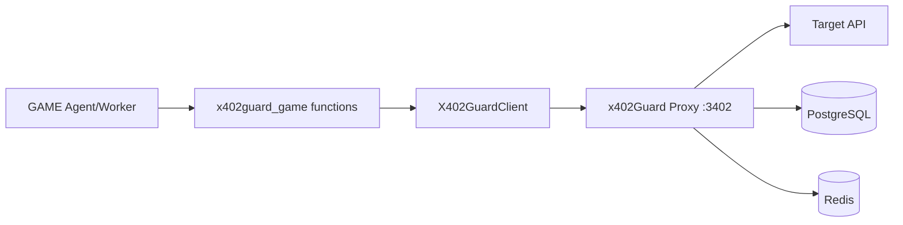

# x402guard-game-plugin

Virtuals Protocol [GAME SDK](https://github.com/game-by-virtuals/game-python) plugin for [x402Guard](https://github.com/x402Guard/x402Guard) -- the non-custodial safety proxy for autonomous DeFi agents.

This plugin wraps the x402Guard proxy as GAME SDK `Function` objects, enabling Virtuals Protocol agents to make **guarded DeFi payments** on Base (EVM) and Solana with configurable guardrail rules.

## Overview

x402Guard acts as a non-custodial proxy between your agent and DeFi APIs. It validates every payment against guardrail rules (max spend per tx, max daily spend, allowed contracts, max leverage, max slippage) before forwarding -- protecting agent wallets from overspending, unauthorized contracts, and exploits.

This plugin provides:

- **X402GuardClient** -- typed Python client for all proxy endpoints
- **GAME SDK Functions** -- `make_guarded_payment` and `query_solana_vault` as plug-and-play GAME functions
- **Pre-built WorkerConfig** -- `defi_worker` ready to register with your GAME Agent
- **Typed error handling** -- `GuardrailViolationError` with parsed rule type, limit, and actual values

## Architecture



## Prerequisites

- Python 3.11+
- Docker and Docker Compose (for x402Guard proxy)
- pip

## Quick Start

1. **Clone the repository:**
   ```bash
   git clone https://github.com/x402Guard/x402Guard.git
   cd x402Guard
   ```

2. **Install the plugin:**
   ```bash
   cd examples/virtuals
   pip install -e ".[dev]"
   ```

3. **Start the x402Guard proxy:**
   ```bash
   # From the repo root
   docker compose up -d
   ```

4. **Set environment variables:**
   ```bash
   export X402GUARD_PROXY_URL=http://localhost:3402
   ```

5. **Run the demo:**
   ```bash
   # Worker mode (no API key needed)
   python demo/demo_worker.py

   # Agent mode (requires VIRTUALS_API_KEY)
   VIRTUALS_API_KEY=your-key python demo/demo_agent.py
   ```

## Two Demo Modes

### Worker Mode (No API Key)

Calls GAME function executables directly without creating a GAME Agent. Demonstrates the full SDK lifecycle:

1. Health check the proxy
2. Register an agent
3. Set a MaxSpendPerTx guardrail (1 USDC)
4. List configured rules
5. Show SDK API capabilities

```bash
python demo/demo_worker.py
```

### Agent Mode (Requires VIRTUALS_API_KEY)

Creates a full GAME Agent with the `defi_worker` and runs it for several steps. The GAME LLM planner autonomously decides when to call `make_guarded_payment`.

```bash
VIRTUALS_API_KEY=your-key python demo/demo_agent.py
```

Get your API key from [game.virtuals.io](https://game.virtuals.io).

## Configuration Reference

| Environment Variable    | Default                    | Description                          |
|------------------------|----------------------------|--------------------------------------|
| `X402GUARD_PROXY_URL`  | `http://localhost:3402`    | x402Guard proxy URL                  |
| `X402GUARD_AGENT_ID`   | *(none)*                   | Default agent ID for SDK calls       |
| `X402GUARD_LOG_LEVEL`  | `INFO`                     | Logging level (DEBUG/INFO/WARN/ERROR)|
| `VIRTUALS_API_KEY`     | *(none)*                   | Virtuals Protocol GAME API key       |

## SDK API Reference

### X402GuardClient

Synchronous HTTP client with typed request/response dataclasses.

```python
from x402guard_game import X402GuardClient, X402GuardConfig

config = X402GuardConfig(proxy_url="http://localhost:3402")
with X402GuardClient(config) as client:
    # Health check
    ok = client.health_check()

    # Create agent
    from x402guard_game import CreateAgentRequest
    agent = client.create_agent(
        CreateAgentRequest(name="my-agent", owner_address="0x...")
    )

    # Set guardrail
    from x402guard_game import CreateRuleRequest, max_spend_per_tx
    rule = client.create_rule(
        agent.id,
        CreateRuleRequest(rule_type=max_spend_per_tx(1_000_000))
    )

    # List rules
    rules = client.list_rules(agent.id)

    # Proxy payment (EVM)
    from x402guard_game import ProxyRequest
    resp = client.proxy_payment(ProxyRequest(
        target_url="https://api.example.com/pay",
        x402_payment="...",
        x402_requirements="...",
        agent_id=agent.id,
    ))

    # Proxy payment (Solana)
    from x402guard_game import SolanaProxyRequest
    sol_resp = client.proxy_solana_payment(SolanaProxyRequest(
        target_url="https://api.example.com/pay",
        network="solana-devnet",
        vault_owner="...",
        amount=500_000,
        x402_payment="...",
    ))

    # Vault status
    vault = client.get_vault_status("owner-pubkey")
```

### Available Methods

| Method                   | HTTP           | Description                    |
|-------------------------|----------------|--------------------------------|
| `health_check()`        | GET /health    | Check proxy availability       |
| `create_agent(req)`     | POST /api/v1/agents | Register new agent        |
| `get_agent(id)`         | GET /api/v1/agents/:id | Get agent details      |
| `create_rule(id, req)`  | POST /api/v1/agents/:id/rules | Add guardrail   |
| `list_rules(id)`        | GET /api/v1/agents/:id/rules | List guardrails  |
| `create_session_key()`  | POST /api/v1/agents/:id/session-keys | Create key |
| `revoke_all(id, req)`   | POST /api/v1/agents/:id/revoke-all | Revoke keys |
| `proxy_payment(req)`    | POST /api/v1/proxy | EVM proxy payment         |
| `proxy_solana_payment()` | POST /api/v1/proxy/solana | Solana proxy payment |
| `get_vault_status(pk)`  | GET /api/v1/solana/vault/:owner | Vault status    |

### GAME SDK Functions

```python
from x402guard_game.functions import (
    make_guarded_payment,   # Executable function
    query_solana_vault,     # Executable function
    guarded_payment_fn,     # GAME Function object
    solana_vault_fn,        # GAME Function object
    defi_worker,            # Pre-built WorkerConfig
)
```

### Rule Type Helpers

```python
from x402guard_game import (
    max_spend_per_tx,    # MaxSpendPerTx rule
    max_spend_per_day,   # MaxSpendPerDay rule
    allowed_contracts,   # AllowedContracts rule
    max_leverage,        # MaxLeverage rule
    max_slippage,        # MaxSlippage rule
)

# Create a rule limiting per-transaction spend to 1 USDC
rule_type = max_spend_per_tx(1_000_000)
# Serializes to: {"type": "MaxSpendPerTx", "params": {"limit": 1000000}}
```

## GAME SDK Integration

Register the pre-built `defi_worker` in your own Agent:

```python
from game_sdk.game.agent import Agent
from x402guard_game.functions import defi_worker

agent = Agent(
    api_key="your-virtuals-api-key",
    name="my-defi-agent",
    agent_goal="Execute guarded DeFi payments",
    agent_description="An agent that uses x402Guard for safe payments",
    get_agent_state_fn=lambda: {"status": "ready"},
    workers=[defi_worker],  # Add x402Guard worker
)

agent.run(steps=5)
```

## Error Handling

The SDK provides a typed exception hierarchy:

```python
from x402guard_game import (
    X402GuardError,            # Base exception
    GuardrailViolationError,   # 403 - rule blocked the tx
    ProxyUnreachableError,     # Connection failed
    SessionKeyExpiredError,    # 401 - key expired
    RateLimitedError,          # 429 - rate limited
)

try:
    resp = client.proxy_payment(req)
except GuardrailViolationError as e:
    print(f"Blocked by {e.rule_type}")
    print(f"  Limit:  {e.limit}")
    print(f"  Actual: {e.actual}")
except ProxyUnreachableError:
    print("Proxy is down - is docker compose up?")
except RateLimitedError as e:
    print(f"Rate limited, retry after {e.retry_after}s")
```

## Troubleshooting

### Proxy unreachable

```
ProxyUnreachableError: Proxy unreachable at http://localhost:3402 -- is docker compose up running?
```

**Fix:** Start the proxy with `docker compose up -d` from the repo root.

### Missing API key (Agent Mode)

```
ERROR: VIRTUALS_API_KEY environment variable is required.
```

**Fix:** Get an API key from [game.virtuals.io](https://game.virtuals.io) and set the env var.

### game_sdk not installed

```
ERROR: game_sdk not installed.
```

**Fix:** Install with `pip install game-python-sdk`.

### Wrong Python version

```
SyntaxError: X | Y union syntax
```

**Fix:** Use Python 3.11 or later. Check with `python --version`.

### Connection refused on port 3402

Make sure Docker is running and the proxy container is up:
```bash
docker compose ps
docker compose logs proxy
```

## Development

```bash
# Install dev dependencies
pip install -e ".[dev]"

# Run unit tests
pytest tests/unit/ -v

# Run integration tests (requires running proxy)
X402GUARD_INTEGRATION=1 pytest tests/integration/ -v

# Type checking (may need --ignore-missing-imports for game_sdk)
mypy src/x402guard_game/ --ignore-missing-imports
```

## License

MIT
